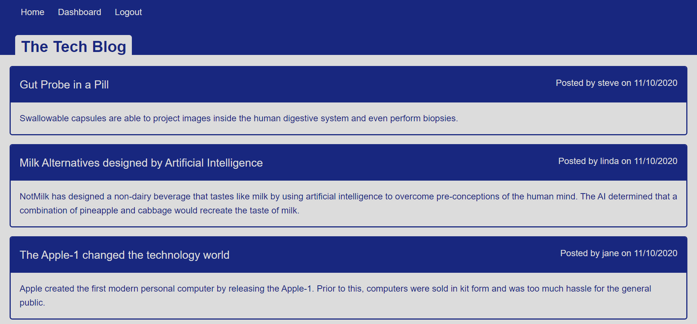
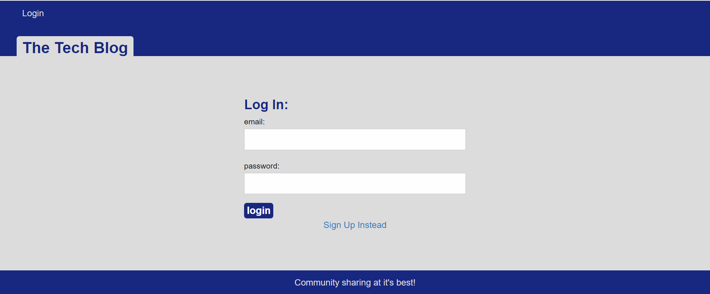
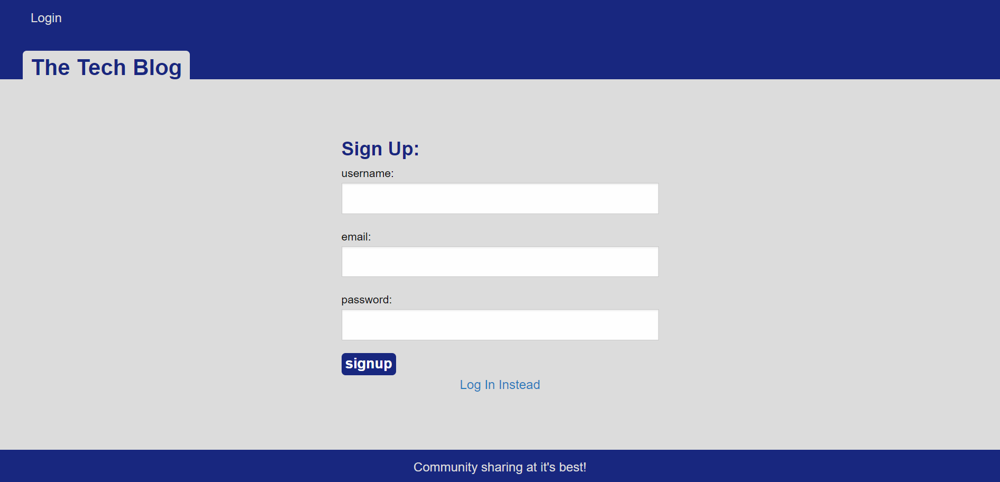
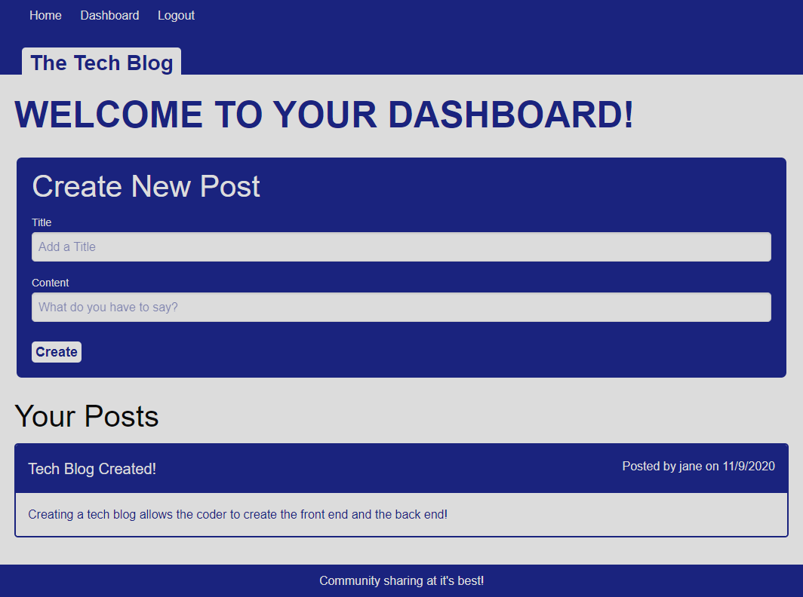

# Tech_Blog

## Table of Contents
* [Description](#description)
* [Installation](#installation)
* [Usage](#usage)
* [Contributing](#contributing)
* [Tests](#tests)
* [License](#license)
* [Questions](#questions)

## Description <a name="description"></a>
This is a blogging application that allows developers to publish blog posts and to view and comment on other's posts as well.  This application was written with the intent of creating a full-stack application without starter code.  The application was written in Javascript and utilizes multiple npm packages for the back-end and vanilla CSS and Foundation for the front-end.  The application follows the Model-View-Controller paradigm and uses Sequelize and MySQL for the database for the Models, Express-Handlebars for the Views, and Express to create the API for the Controllers.  The application further uses Express-Session and Connect-Session-Sequelize to add authentication and DotEnv and Bcrypt to hash passwords.  The front-end user inteface was designed using Foundation cards for post data then styled with vanilla CSS.  

## Installation <a name="installation"></a>
To run this application, please do the following: 

1. Clone the application's respository from GitHub onto your local drive.  The GitHub URL is: https://github.com/plainjane99/Tech_Blog.  
2. Set up the ```npm``` package by running the following command in the root directory of the application: 
    
    ```
    npm install
    ```
    
    This will download the application's dependencies into your root directory.  You should now have a folder called ```node_modules``` and a file called ```package-lock.json```.  The ```package-lock.json``` file should include ```bcrypt```, ```connect-session-sequelize```, ```dotenv```, ```express```, ```express-handlebars```, ```express-session```, ```mysql2```, and ```sequelize```.
3. A ```.env``` file will need to be created with the following code:
```
DB_NAME='ecommerce_db'
DB_USER='root'
DB_PW='your-mysql-password-here'
```
4. A ```.gitignore``` file should be created to include your ```.env``` and the ```node-modules``` folder if you intend to push your code to a public repository.

## Usage <a name="usage"></a>
Once installation is complete, enter the following into the command line:
1.  Run the application by typing the following into the command line at the root directory of the application:

    ```
    npm start
    ```
    
The application will start and indicate the server is running.

2. Once the server is running:
* Route testing can be completed through Insomnia Core to test out the API routes in the ```Controllers``` folder.  
* User Interface testing can be completed at the local host URL ```http://localhost:3001/```

3. The live version of this application is deployed at:  https://secret-temple-20724.herokuapp.com/.  The deployed application ```Homepage``` should resemble the following:



Clicking on the ```Log-In``` link will take you to the ```Log-In``` screen:



If you have a log-in, proceed by logging in, otherwise, click the ```Sign up Instead``` link, which will take you to the ```Sign-Up``` screen:



Once you have entered your username, email, and password, the application will take you to your Dashboard page:



From the ```Dashboard```, you may add a new post or edit your existing posts.  Clicking the ```Home``` link will take you back to the Homepage, which will now allow you to comment on other users' posts.  The ```Logout``` link will log you out of the application.

## Contributing <a name="contributing"></a>
Contributions are welcome.  Please contact me regarding improvements you would like to make.

## Tests <a name="tests"></a>
This application uses Insomnia Core as a testing method for all API routes.

## License <a name="license"></a>
This application is covered under the ISC license.

## Questions <a name="questions"></a>
My GitHub username is ```plainjane99```.  Please feel free to peruse my other projects.

If you have any questions regarding this application, please contact me via email at ```jane99hsu@gmail.com```.
  